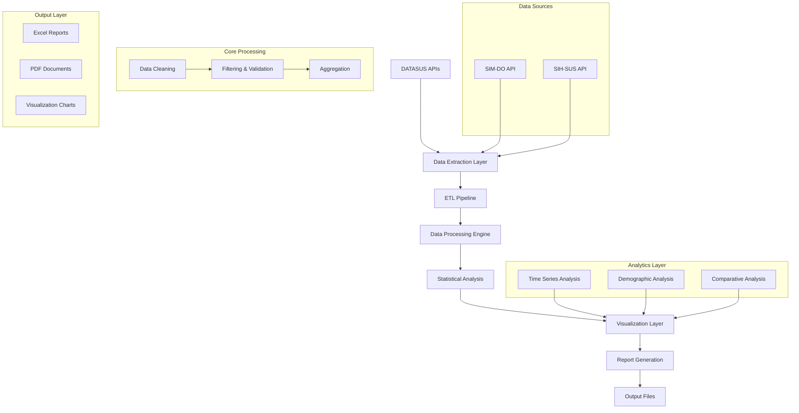

# 🏗️ Arquitetura Técnica do Projeto

## 📊 Visão Geral da Arquitetura

Este projeto implementa um **pipeline de dados epidemiológicos** end-to-end, desde a coleta de dados públicos até a geração de relatórios científicos automatizados.



## 🔧 Stack Tecnológico Detalhado

### **🐍 Core Python Ecosystem**
| Componente | Versão | Propósito | Justificativa Técnica |
|------------|--------|-----------|----------------------|
| **Python** | 3.8+ | Runtime Environment | Compatibilidade com bibliotecas científicas |
| **Pandas** | 2.0+ | Data Manipulation | Performance otimizada para grandes datasets |
| **NumPy** | 1.24+ | Numerical Computing | Operações matemáticas eficientes |

### **📡 Data Integration Layer**
| Tecnologia | Função | Implementação |
|------------|---------|---------------|
| **PyDataSUS** | API Client | Cliente Python otimizado para DATASUS |
| **Requests** | HTTP Client | Fallback para requisições diretas |
| **JSON/CSV** | Data Formats | Parsing e serialização de dados |

### **📊 Analytics & Visualization**
| Framework | Uso Específico | Vantagens |
|-----------|----------------|-----------|
| **Matplotlib** | Static Charts | Qualidade científica, controle granular |
| **Seaborn** | Statistical Plots | Visualizações estatísticas elegantes |
| **Plotly** | Interactive Charts | Interatividade e exportação flexível |

### **📄 Document Generation**
| Biblioteca | Funcionalidade | Casos de Uso |
|------------|----------------|--------------|
| **ReportLab** | PDF Creation | Relatórios científicos profissionais |
| **OpenPyXL** | Excel Files | Planilhas com fórmulas e formatação |
| **Kaleido** | Image Export | Conversão de gráficos Plotly para PNG |

## 🏛️ Padrões Arquiteturais

### **1. Separation of Concerns**
```python
# Cada módulo tem responsabilidade única
├── main.py                    # Análise de mortalidade
├── analise_morbidade_diabetes.py  # Análise de morbidade  
├── gerar_relatorio_pdf.py     # Geração de relatórios
└── executar_simples.py        # Orquestração do pipeline
```

### **2. Error Handling & Resilience**
- **Graceful Degradation**: Fallback para dados sintéticos se API falhar
- **Validation Gates**: Verificação de integridade em cada etapa
- **Logging**: Rastreamento detalhado de execução

### **3. Configuration Management**
- **Environment Variables**: Configurações sensíveis
- **Constants**: Parâmetros configuráveis centralizados
- **Path Management**: Caminhos relativos e absolutos

## 🔄 Pipeline de Processamento

### **Fase 1: Data Extraction**
```python
def download_datasus_data(start_year, end_year, state):
    """
    Estratégia multi-source para extração robusta
    """
    try:
        # Método primário: PyDataSUS
        data = download(dataset, state, year)
    except Exception:
        # Fallback: Dados sintéticos para demonstração
        data = create_sample_data()
    return data
```

### **Fase 2: Data Transformation**
```python
def process_diabetes_data(raw_data):
    """
    Pipeline ETL com validação em cada etapa
    """
    # 1. Cleaning
    cleaned = clean_missing_values(raw_data)
    
    # 2. Filtering
    filtered = filter_diabetes_cases(cleaned, age_range=(0, 14))
    
    # 3. Validation
    validated = validate_data_quality(filtered)
    
    # 4. Aggregation
    aggregated = aggregate_by_temporal_demographic(validated)
    
    return aggregated
```

### **Fase 3: Statistical Analysis**
```python
def generate_insights(processed_data):
    """
    Análises estatísticas com múltiplas perspectivas
    """
    insights = {
        'temporal_trends': analyze_time_series(processed_data),
        'demographic_patterns': analyze_demographics(processed_data),
        'comparative_metrics': calculate_ratios(processed_data)
    }
    return insights
```

## 📈 Algoritmos e Metodologias

### **Time Series Analysis**
- **Trend Detection**: Identificação de tendências de crescimento/declínio
- **Seasonality**: Análise de padrões sazonais em internações
- **Anomaly Detection**: Identificação de outliers estatísticos

### **Demographic Analysis**
- **Age Stratification**: Segmentação por faixas etárias
- **Geographic Patterns**: Análise por município (quando disponível)
- **Risk Profiling**: Identificação de grupos de maior risco

### **Comparative Analysis**
- **Mortality vs Morbidity**: Correlações entre óbitos e internações
- **Type 1 vs Type 2**: Comparação entre tipos de diabetes
- **Temporal Correlations**: Análise de correlações temporais

## 🔒 Aspectos de Segurança e Compliance

### **Data Privacy**
- **Anonymized Data**: Dados públicos sem identificação pessoal
- **Aggregate Only**: Processamento apenas de dados agregados
- **No PII Storage**: Sem armazenamento de informações pessoais

### **Legal Compliance**
- **LAI Compliance**: Acordo com Lei de Acesso à Informação
- **Public Data Only**: Uso exclusivo de dados públicos
- **Scientific Purpose**: Finalidade acadêmica e científica

## ⚡ Performance e Escalabilidade

### **Otimizações Implementadas**
- **Vectorized Operations**: Uso de operações pandas vectorizadas
- **Memory Management**: Processamento em chunks para grandes datasets
- **Caching Strategy**: Cache de resultados intermediários

### **Potential Scalability**
- **Parallel Processing**: Possibilidade de paralelização por estado/ano
- **Database Integration**: Adaptação para bancos de dados relacionais
- **API Endpoints**: Conversão para serviços web RESTful

## 🧪 Testing Strategy

### **Data Quality Tests**
```python
def test_data_integrity():
    """Testes de integridade dos dados"""
    assert all(ages >= 0 and ages <= 14)
    assert all(years >= 2010 and years <= 2025)
    assert no_duplicate_records()
```

### **Statistical Validation**
```python
def test_statistical_validity():
    """Validação estatística dos resultados"""
    assert mortality_rate < 100  # Taxa de mortalidade realística
    assert correlation_coefficients_in_range(-1, 1)
```

## 📊 Métricas e Indicadores

### **Business Metrics**
- **Mortality Rate**: Taxa de mortalidade por 100,000 crianças
- **Hospitalization Rate**: Taxa de internação por diabetes
- **Average Length of Stay**: Tempo médio de internação
- **Trend Analysis**: Variação percentual ano a ano

### **Technical Metrics**
- **Data Completeness**: % de registros completos
- **Processing Time**: Tempo de execução do pipeline
- **Memory Usage**: Consumo de memória durante processamento
- **API Response Time**: Latência das chamadas DATASUS

---

> 📋 **Nota Técnica**: Esta arquitetura foi projetada para ser **modular**, **escalável** e **maintível**, seguindo as melhores práticas de engenharia de software aplicadas à análise de dados científicos.